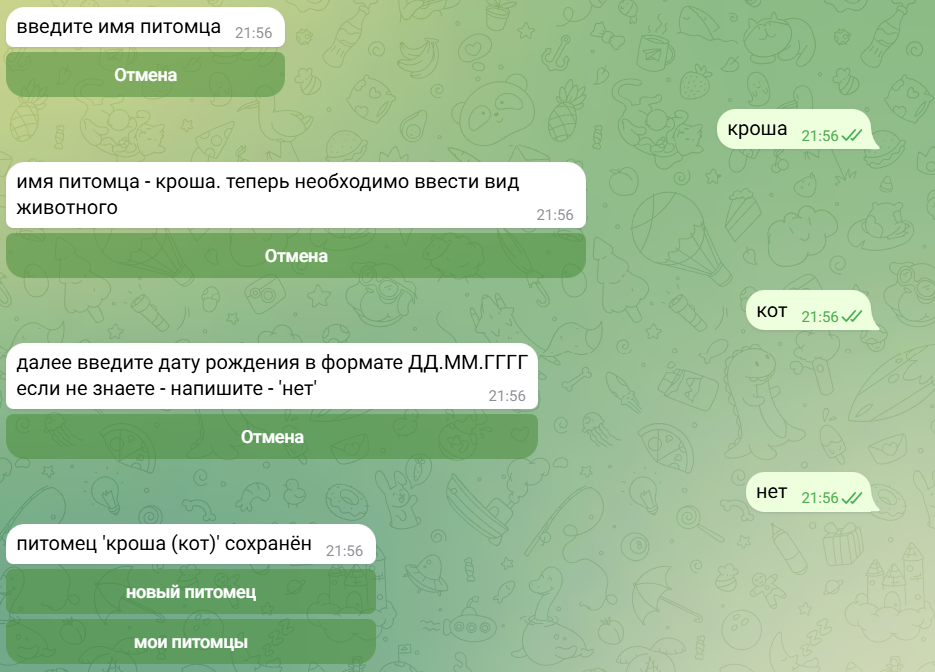
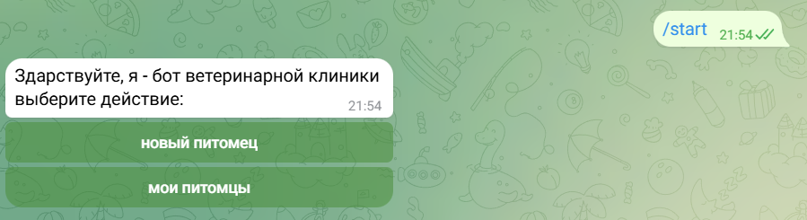
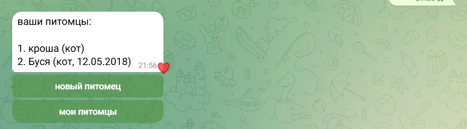

# Телеграмм бот для ветеринарной клиники

Проект направлен на упрощение регистрации новых хозяев и их питомцев.
Реализовано как тестовое задание от IT HUB.

## Основные кнопки программы
 
 - Стартовое сообщение с кнопками новый питомец и мои питомцы
 - Регистрация нового питомца
 - Просмотр всех питомцев 
 - Отмена регистрации питомца

## Особенности реализации и функционал

1) Реализована одна из трех обязательных функций. 
2) Подключена БД
3) Реализован класс Pet в файле models.py. (Объектно-ориентированная модель)

## Идеи для дополнения проекта

1) Реализация входа для врачей и администраторов, раньше пользователя, то есть разный интерфейс при совпадении со специальном айди 
2) Запись к врачу
3) Медицинская карточка в виде файла с расширением.docx
4) Реализация редактированик к медицинской карточке, животному и записей ко врачу

## Инструкция по использованию

Интуитивное использование, не требующее какой-либо инструкции

**Запуск:**

1) Установите необходимые зависимости, выполнив команду
    `pip install -r requirements.txt`

2) Запуск проекта можно осуществить через файл "main.py".

<h3>Скриншоты использования</h3>

